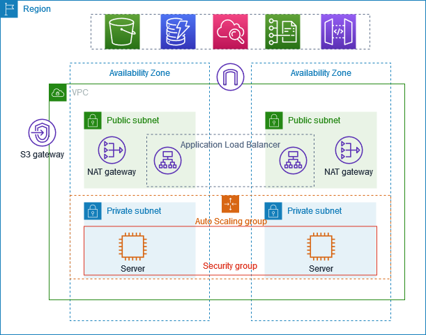
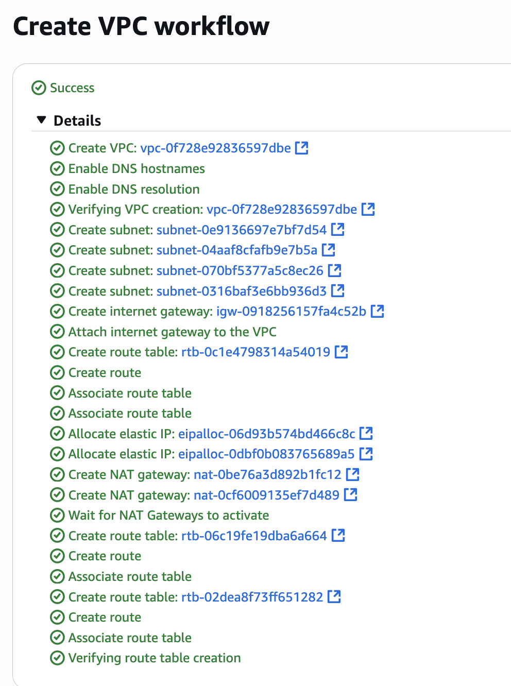
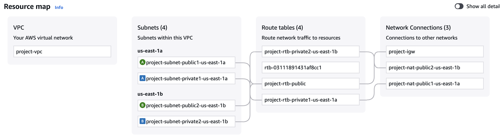
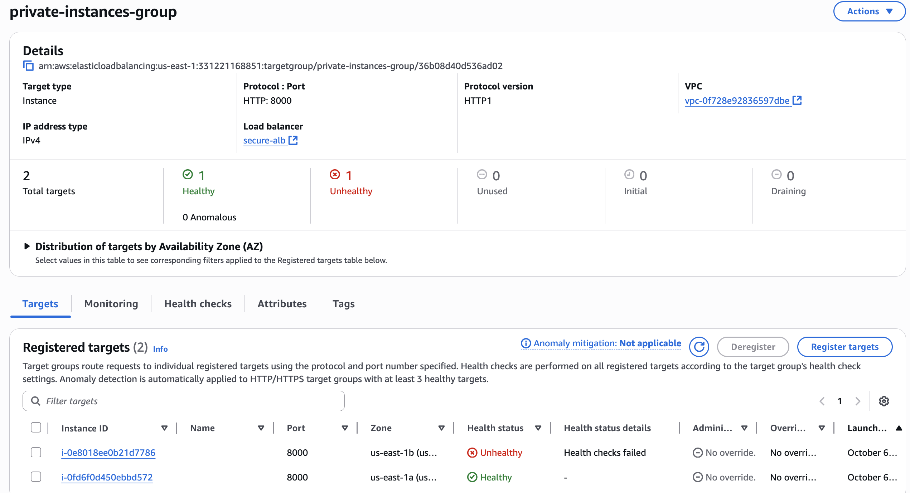

# AWS setup for High Availability Scalability and Resiliency

1. Created VPC
2. Deployed servers in 2 AZs
3. Used Auto-Scaling Groups
4. Configured Application Load Balancer (ALB)
5. Configured NAT as well

Deployed servers only in private subnets for additional security. Servers recieve requests through Load Balancer. Servers connect to the internet using NAT Gateway. To improve resiliency, deployed NAT Gateways to both AZ's.

#### Step 1: Create VPC. Make sure to select 1 NAT Gateway per AZ. 

VPC created with 4 subnets in 2 AZs and a NAT gateway in each AZ

#### Step 2: Create AutoScaling Group  
Create launch template - make sure to include SG that allows inbound traffic on port 22 for SSH and custom TCP Port 8000

While configuring AutoScaling Group, select the newly created VPC, choose 2 private subnets. 

Verify that 2 ec2 instances have been created automatically, one in each AZ

#### Step 3: Install bastion host
The ec2 instaces created exist in the private subnet, which means we cannot connect to it directly. We can use a bastion host in the public subnet to connect to ec2 instances in private subnet. 
Make sure ec2 for bastion-host is configured in the same VPC. Enable auto-assign public IP. 
I can now ssh into my bastion host and then ssh into the instances in private subnet.  
Copy key-value pair (.pem) to bastion host because the bastion host needs this to connect to the instances in private subnet. 

$ scp -v -i aws-key-for-ec2-us-east1.pem aws-key-for-ec2-us-east1.pem ubuntu@54.166.195.76:/home/ubuntu

pem copied into the bastion host

Able to connect to the instances in private subnet using their private IP's

#### Step 4: Install basic application in one of the instances in private subnet

$ vi index.html
<!DOCTYPE html>
<html>
<body>

<h1>My First Instance</h1>

</body>
</html>

$ nohup python3 -m http.server 8000 &
Serving HTTP on 0.0.0.0 port 8000 (http://0.0.0.0:8000/) ...

#### Step 5: Setup load balancer
Create application load balancer
Create target group

ALB successfully configured and available for public access

// deleted load balancer, target groups, ec2 instances, ASG, ASG launch template, VPC, Network interfaces, NAT Gateways